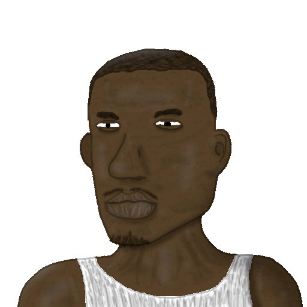

# GTA SA Modloader Controller
Un controlador del archivo de configuración `modloader.ini`. Puedes establecer perfil, configurar secciones de perfiles, crear perfiles, remover perfiles. 

Todo; desde pioridades hasta los boleanos. Menteniendo limites lógicos, y nomenclaturas logicas para los perfiles a guardar.



## Dependencias `GNU/Linux`
```bash
sudo apt update
sudo apt install python3-pyqt6 pyqt6-dev-tools qt6-base-dev
```

## Compilación con `pyinstaller`
**Windows y GNU/Linux**
```bash
pyinstaller --windowed --icon="./resources/icons/gta_sa_modloader_controller.png" "./main.py"
```

## Uso
Si ya tienes tu modloader configurado, haz un backup de tu `modloader.ini`. Copy, Paste, and Raneme; Like `modloader_backup.ini`.

Pon el programa dentro del directorio de tu gta sa, con el `modloader\modloader.ini` ya existente. Ejecutalo, y usa permisos de admnistrador si tienes el juego en ruta admin. Como por ejemplo `C:\ProgramFiles*`.
